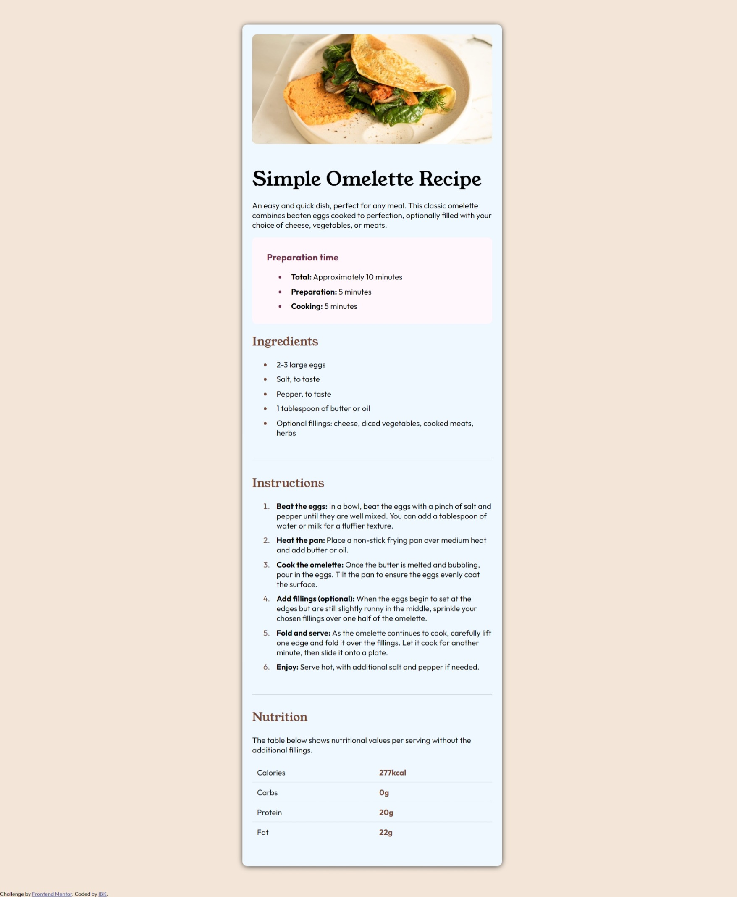

# Frontend Mentor - Recipe page solution

This is a solution to the [Recipe page challenge on Frontend Mentor](https://www.frontendmentor.io/challenges/recipe-page-KiTsR8QQKm). Frontend Mentor challenges help you improve your coding skills by building realistic projects. 

## Table of contents

- [Overview](#overview)
  - [Screenshot](#screenshot)
  - [Links](#links)
- [My process](#my-process)
  - [Built with](#built-with)
  - [What I learned](#what-i-learned)
  - [Continued development](#continued-development)
- [Author](#author)
- [Acknowledgments](#acknowledgments)


## Overview

### Screenshot




### Links

- Solution URL: [Add solution URL here](https://your-solution-url.com)
- Live Site URL: [Add live site URL here](https://your-live-site-url.com)

## My process

### Built with

- Semantic HTML5 markup
- CSS custom properties
- Flexbox
- Mobile-first workflow
- HTML
- CSS


### What I learned

while working on this I was able to refresh my basic HTML and CSS knowledge and I will be doing more of this in the coming week although i did a lot of google search and asked AI for a few tips however I am working on reducing this going forward. However they were few line of codes that amazed me and I feel proud I was able to figure them out.
Also I had issue with styling the table but with a few reserch I was able to conqure it. I should work more on table styling going forward.
For HTML I feel really happy I was able to use semantic appropraitly at least to my knowledge and the CSS I used more of relevant tags and not just random element like i used to

```html
<article>
  <section> 

  </section>
</article>
```
```css
@media screen and (max-width: 600px) {
  .container {
    box-shadow: none;
    margin: 0;
    padding: 0;
  }
  body {
    background-color: aliceblue;
  }
  .container img {
    margin: 0;
    padding: 0;
    width: 100%;
    height: auto;
    border-radius: 0;
  }
  section:not(.hero){
    margin: 20px;
  }
  .hero h1, .hero p{
      margin: 20px;
  }

}
```

### Continued development

In as much as this is the begining of a great thing in my journey to CLoud engineering I am more than please to be pushing it this hard and I am wlling to keep this going till the end all thnaks to AltSchool for bringing this back to me!


## Author
- Twitter - [@Adewale](https://x.com/__Adewale__)


## Acknowledgments

This project is a task from Frontend Mentor and was suggeted by a fellow AltSchool learner Ukuanovwe

